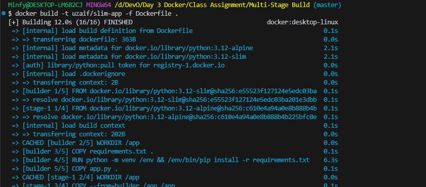
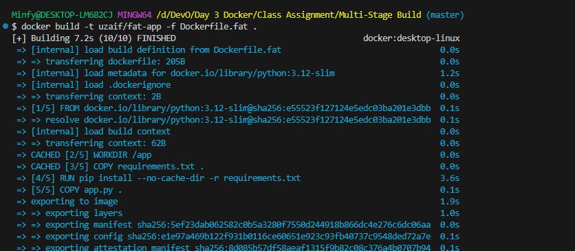
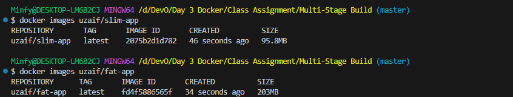
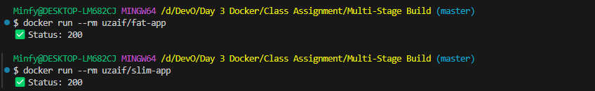
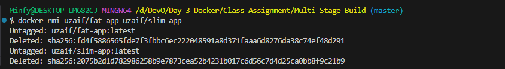

# Multi-Stage Build

I tried to compare multi-stage build to the usual single stage build on a simple python application.

### Build Multi-Stage (SLIM) Image

### Build Single-Stage (Fat) Image

### Compare Image Size

### Run Both Containers

### Cleanup
