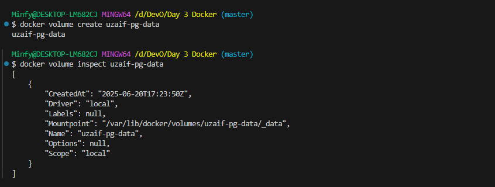
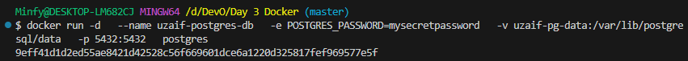
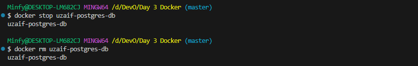
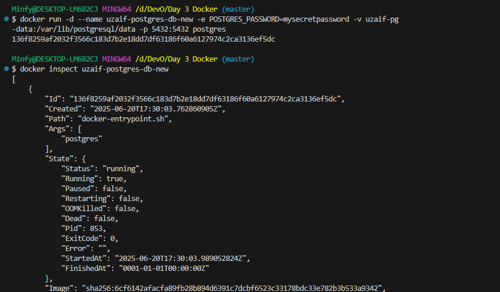
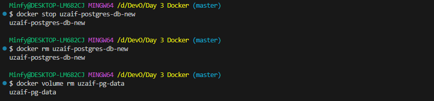

# Using a Named Volume with a Database

### Create a named volume

###  Run a PostgreSQL container using this volume

### Simulate a disaster! Remove the container

### Re-create the container using the same volume

### Cleanup:
