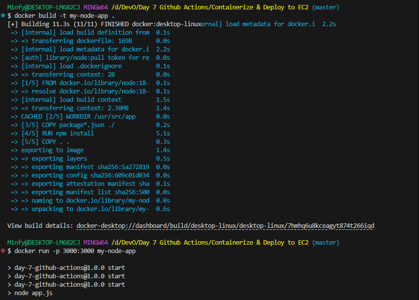
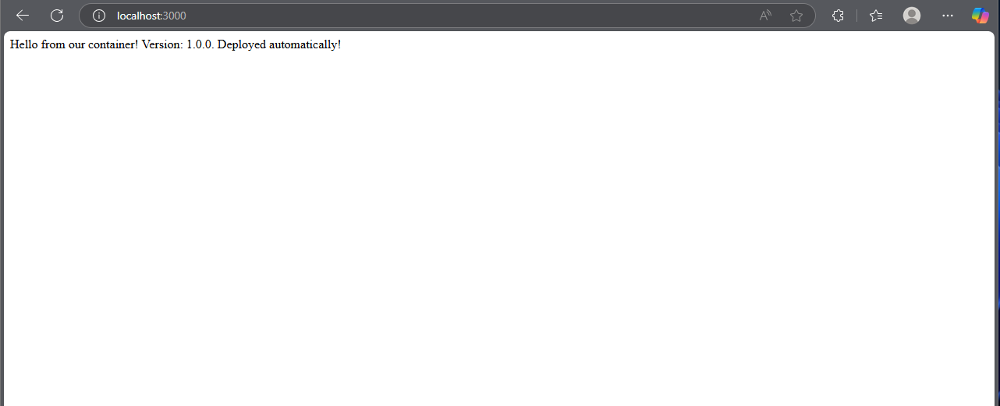
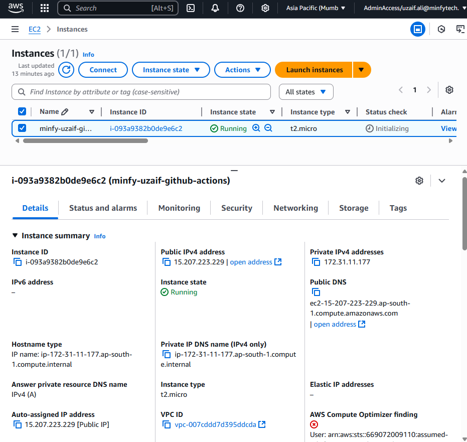
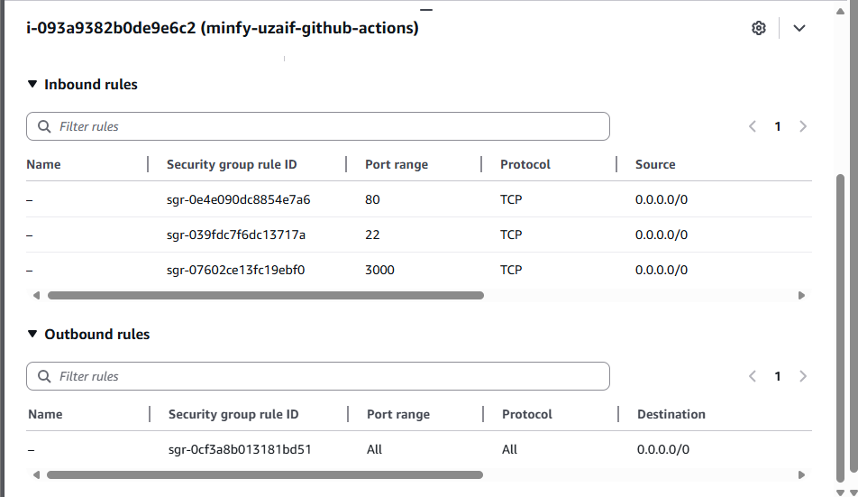
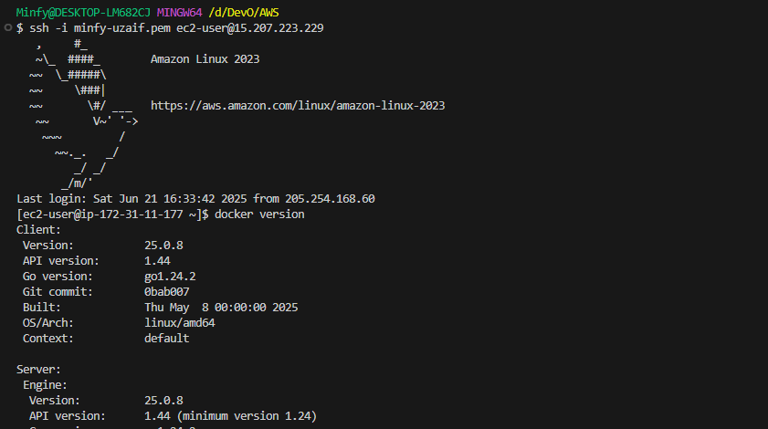
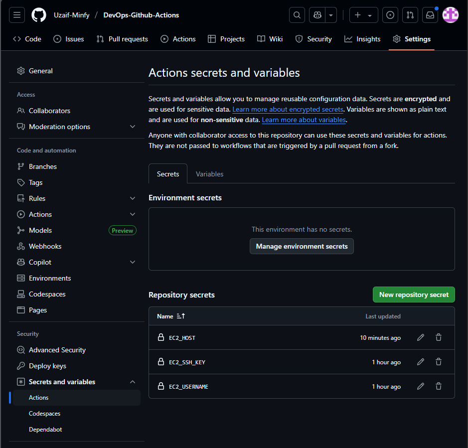
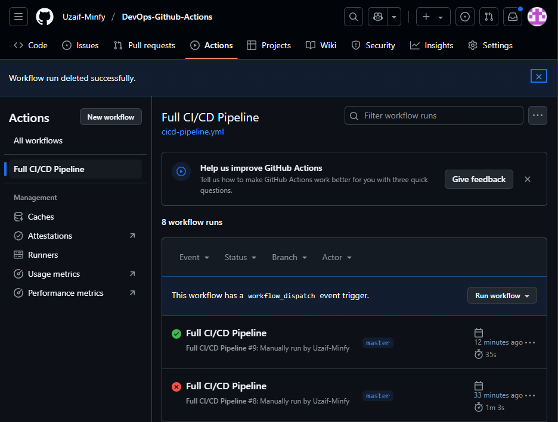
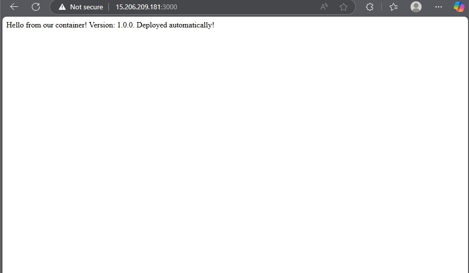
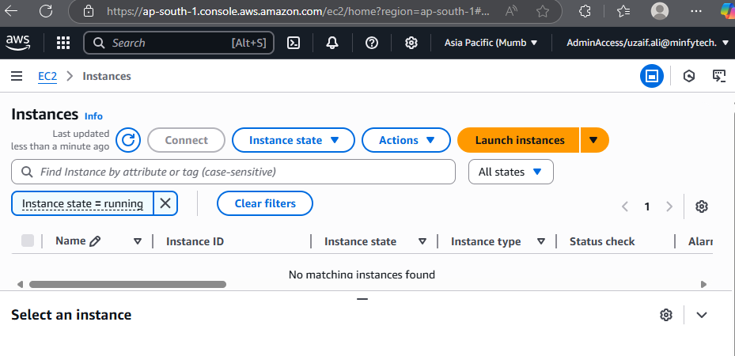

# The Capstone Project - Containerize & Deploy to EC2

### Local Test: Build and Run the Docker Container

### Server Setup:

Launch an EC2 instance:

Installed Docker on the EC2 instance

### Add GitHub Secrets:

### Final Test: The Magic of Automation

### Cleanup: Terminated EC2 instance
