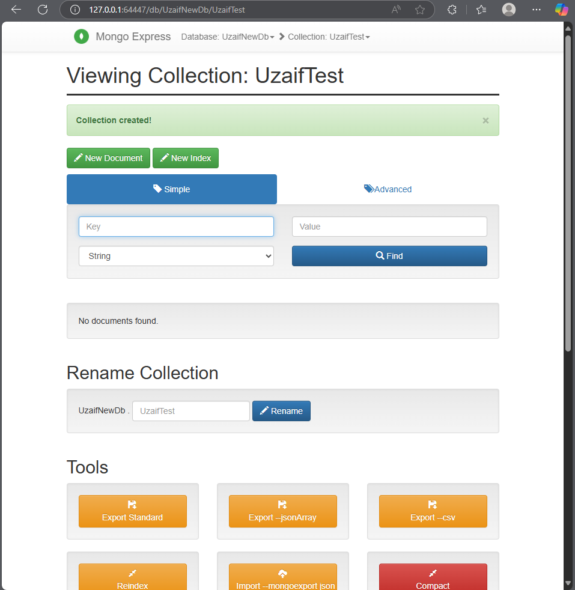
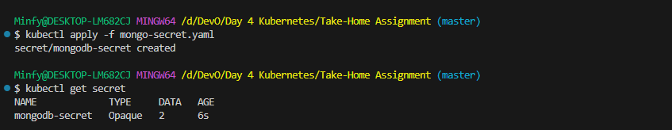
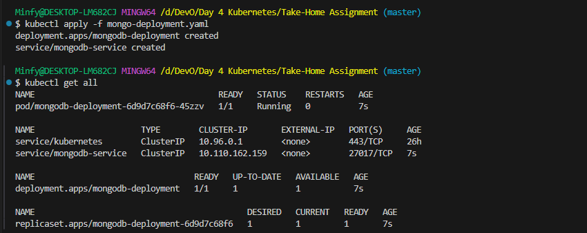
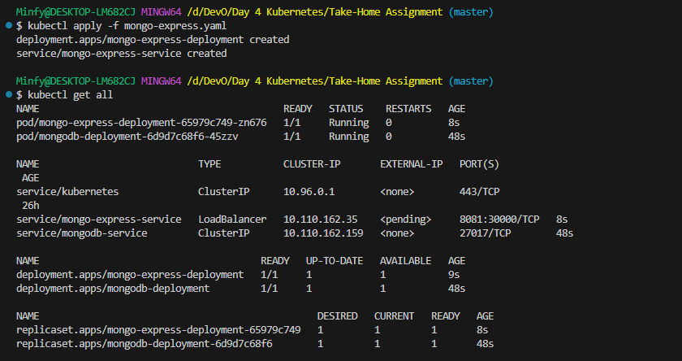

Step 1: Create a Secure Vault for Credentials with Secret

Step 2: Deploy MongoDB using a Deployment and Service

Step 3: Create a ConfigMap for Non-Sensitive Data

Step 4: Deploy Mongo-Express and Expose it with an External Service

Accessing and Testing
